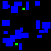
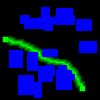
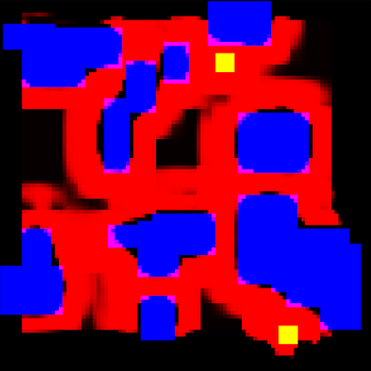
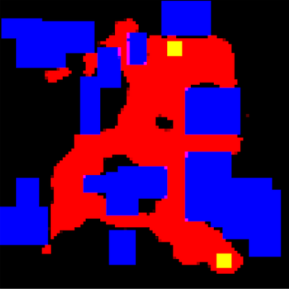

# **Autoencoder and U-Net Based Path Planning**

This is final project of a motion planning using the basic methods of machine intelligence course. 
The objective of this project is to generate path from point A to B using autoencoder and U-Net neaural network architecture.

## **Data generation**

Data generation consist of two main parts.
In first step, we have generated maps and points on them.
The next step was to generate a path between the points.

### **Maps Generation**

To generate maps we have written .ipynb. Scripts genereated randomly located obstacles and two points with fixed minimal distance between them.

    

### **Path generation**

To determine optimal path between two points, we have written C++ program using the Open Motion Planing library and the RRT* algorithm. After the map is generated we modified it with .ipynb script to make the path thicker and add gradient to it.

    

After adding two images together we can easly see the result.

    

## **Machine learning methods**

In this research for creating models we have used tensorflow library.
Both models were learned in the same way, by passing map with points to input and the path as an expected result. 
For both models we have used Tversky loss.

### **Autoencoder**

Example autoencoder result.

    

### **U-Net**

Example U-Net result.

    

## **Summary**

U-net thanks to it's advanced architecture provide better results than autoencoder model. For now results from U-Net neural network can be used to limit the search field of classical algorithms. 
In this research, models were fed with only 1000 samples. In order to obtain better results more data can be generated.
Tunning hyperparameters such as filters size and Tverski loss also can provide better results.

