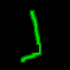

# Autoencoder and U-Net Based Path Planning

This is final project of a motion planning using the basic methods of machine intelligence course. 
The objective of this project is to generate path from point A to B using autoencoder and U-Net neaural network architecture.

## Data generation
### Maps Generation

A special python script has been written to generate the maps and points.

### Path generation

For path genration RRT* algorithm was used from Open Motion Planing library.

## Autoencoder

## U-Net

